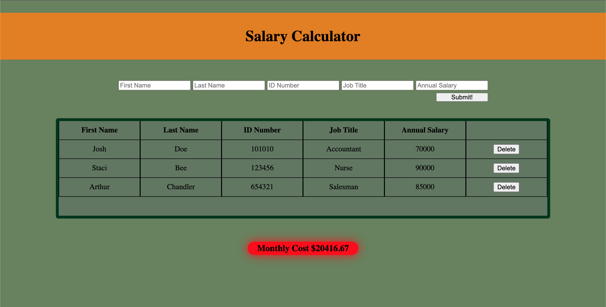

# Salary Calculator

## Description

_Duration: _Weekend Project

This project was done in order to get solidify my understanding of Javascript, JQuery, HTML, and CSS.

The problem was made to fulfill a hypothetical business need, to create a salary calculator that takes in a person's _firstname, _lastname, _ID _number, _job _title, and _annual _salary. There needed to be an input button that the user could click, which would import all that information to a table on the DOM, and update a number that would keep track of the sum of the monthly salaries of employees. If the combined monthly salaries exceed $20,000 then the salary counter is supposed to turn red to indicate that the business was going over-budget. Lastly, when a user add an employee to the table, they should be able to click a delete button that removes the employee from the list and subtracts that employee's salary from the total.

To solve this I used JQuery to connect the input fields to a function that would store the entered information to a global array, and append that data to the table, along with a delete button. The salary data was output into a function which would update the monthly total, and use if/else logic to know if the total costs were well below, getting close to, or surpassing the $20,000 limit. Depending on this information the function would call JQuery to change the CSS based on those three scenarios. After the cost function had completed it's course, the initial "buttonClick" function would clear the initial input fields to prepare for another employee's information to be entered into the interface.

If the delete button was to be pressed, JQuery would be called to the click-event, where it would identify which delete button had been clicked, identify the salary of the employee from the row that had the delete button, and subtract that salary amount from the running total. After updating the salary/cost counter, the delete function would then identify the parent row that holds that employee's information and remove itself from the HTML.

## Calculator Example

## Built With

1. HTML structure
2. CSS styling
3. Javascript
4. JQuery

## Acknowledgement
Thanks to [Prime Digital Academy](www.primeacademy.io) who equipped and helped me to make this application a reality. (Thank your people)

## Support
If you have suggestions or issues, please email me at [Joshkmanj@gmail.com](www.google.com)